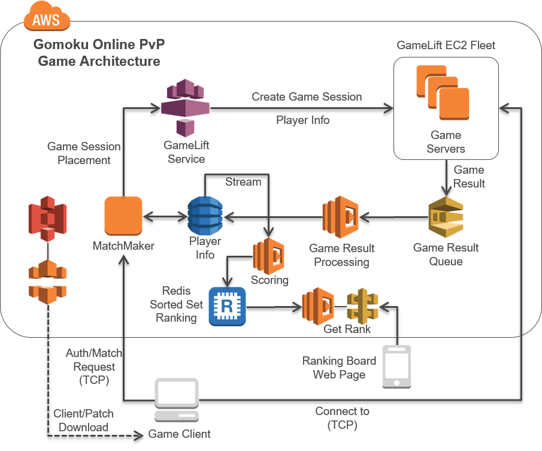
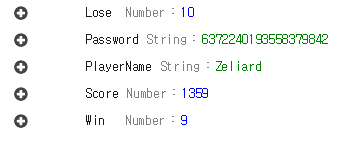
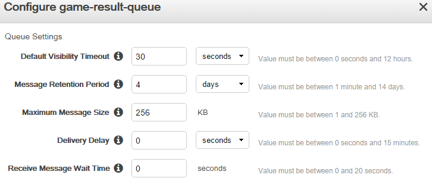
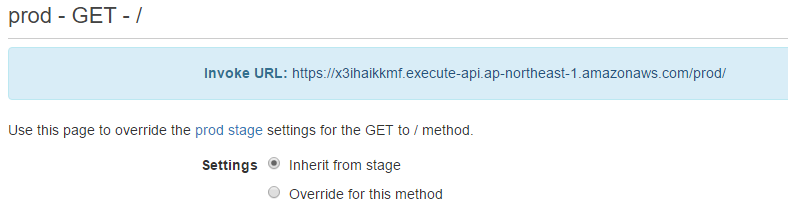
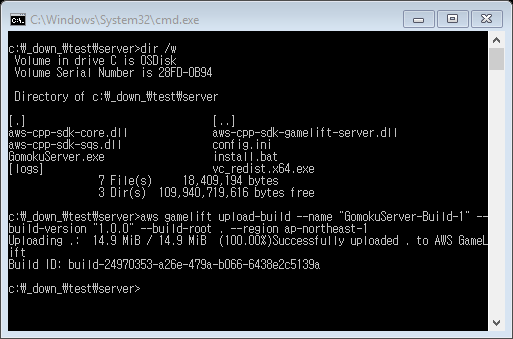
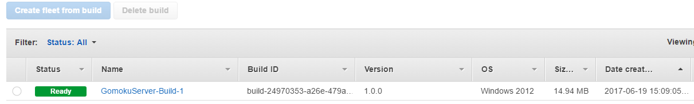
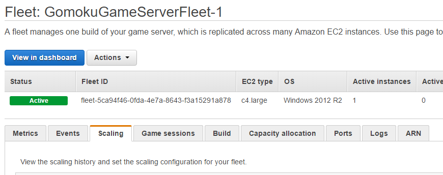
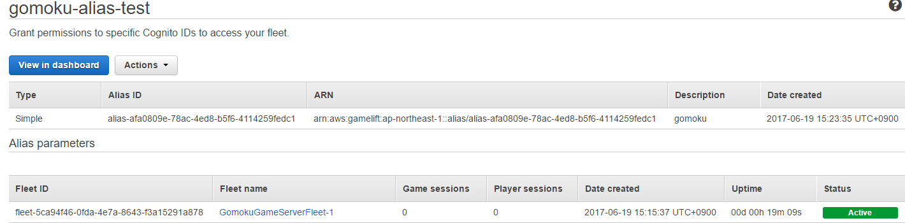
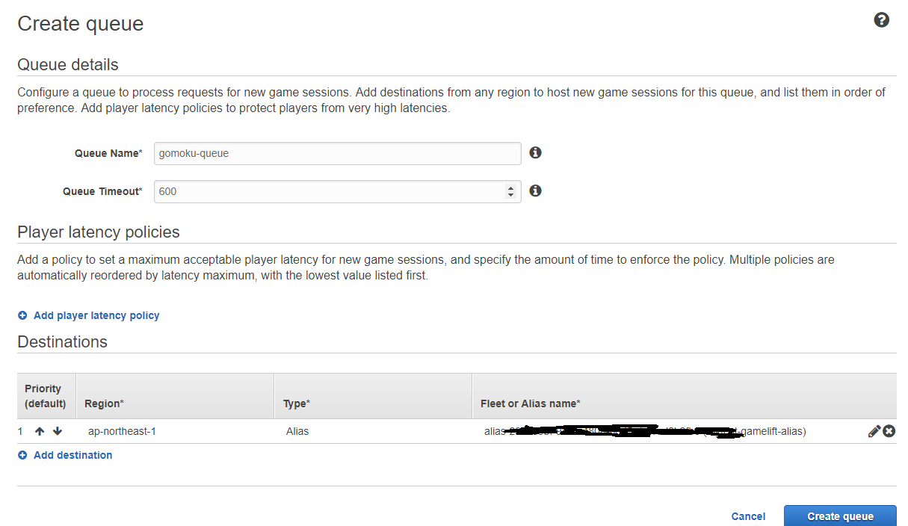
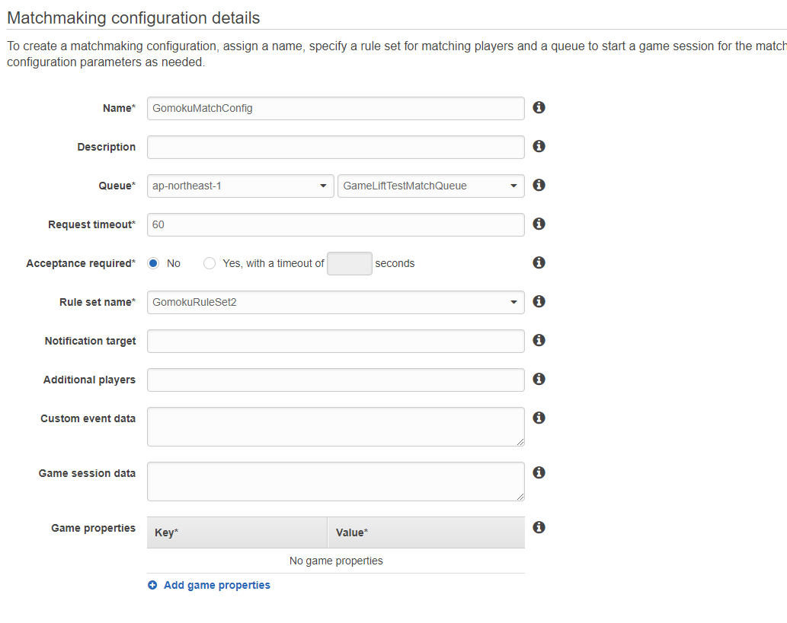

## Architecture Overview

### DynamoDB Table -- Player Info
- Table Name: **GomokuPlayerInfo**
- HashKey: PlayerName (String)
- Attributes: Password (String), Score (Number), Win (Number), Lose (Number)
- Enable Stream with “New and Old images”
- Example Item

### SQS -- Game Result Queue
- Name: **game-result-queue**
- Queue configuration

- Copy & Paste SQS Endpoint to Notepad. It will be used later in the Lambda function (Game Result Processing).

### ElastiCache -- Redis Sorted Set for Ranking 
- Select Redis 3.2.x
- Mostly set to default
- Set the VPC and Security Group: only traffic allowed from this Security Groups
- Copy & Paste Cluster Endpoint to Notepad when the Status is available. It will be used later in the Lambda function (Scoring and GetRanking).

### Lambda -- Game Result Processing
- Name: **game-sqs-process**
- Runtime: Python 3.9
- Role: Basic Lambda Execution role, grant Full Access to SQS and DynamoDB
- Advanced Settings
  - Memory: 128
  - Timeout: 1 min
- Triggers: CloudWatch Events rate 1 minute
- Edit code [GameResultProcessing.py](../Lambda/GameResultProcessing.py) and save it
  -	Replace *region_name* and *queue_url* in the code with your AWS region and SQS endpoint url.

### Lambda -- Scoring (DynamoDB streams to Redis)
- Name: **game-rank-update**
- Runtime: Python 3.9
- Role: Basic Lambda Execution role, grant Full Access to DynamoDB, VPC, and DynamoDB Streams
- Advanced Settings
  - Memory: 192
  - Timeout: 1 min
  - VPC: same with ElastiCache’s
  - Security Group: same with ElastiCache’s
- Triggers: DynamoDB Streams from *GomokuPlayerInfo*
- Edit code [Scoring.py](../Lambda/Scoring.py) and upload it as a deployment package
  - Replace Redis *host* in the code with your ElastiCache cluster endpoint.
  -	For your information: [here](http://docs.aws.amazon.com/lambda/latest/dg/lambda-python-how-to-create-deployment-package.html) is how to create a deployment package for Lambda (python). 

### Lambda -- GetRanking
- Name: **game-rank-reader**
- Runtime: Python 3.9
- Role: Basic Lambda Execution role, grant Full Access to VPC
- Advanced Settings
  - Memory: 128
  - Timeout: 1 min
  - VPC: same with ElastiCache’s
  - Security Group: same with ElastiCache’s
- Edit code [GetRank.py](../Lambda/GetRank.py) and upload it as a deployment package
  - Replace Redis *host* in the code with your ElastiCache cluster endpoint.

### API Gateway -- Get Ranking Board
- Create API Name: **gomokuranking**
- Create Method: GET -- Lambda Integration -- Select region you created a Lambda, *game-rank-reader* -- Select the Lambda and Save.
- Deploy API: give a stage name and remember the Invoke URL. It will be used later in the S3 static website [main.js](../web/main.js).
- API Example

### S3 -- Static Web Page for Ranking Board
- Create a bucket for static website hosting and enable Bucket hosting.
- Edit code [main.js](../web/main.js) and then replace *http endpoint in $.get()* fucntion with your API Gateway Invoke URL.
- Upload files in *web* folder to S3 with public read accessible.
- You can access the ranking board page by S3 static website enpoint.

### GameLift -- Game Server Build & Fleet Creation
- Create an IAM User who can access SQS. (Game Result Queue)
  - Get ACCESS_KEY and SECRET_KEY (this will be used below config.ini)
- Open GomokuServer project in your Visual Studio 2015.
- Build GomokuServer with x64 release mode.
- Put the following files in one folder (a.k.a. server build folder)
  - GomokuServer.exe, aws-cpp-sdk-*.dll (from GomokuServer build folder)
  - config.ini and install.bat (from GomokuServer project root folder)
  - aws-cpp-sdk-gamelift-server.dll (from GomokuServer lib folder)
  - vc_redist_x64.exe (from [here](https://www.microsoft.com/en-us/download/details.aspx?id=48145))
- Edit config.ini file in the server build folder and fill in the required information like the following example

<pre>
    [config]
    SQS_REGION = ap-northeast-1
    SQS_ACCESSKEY = AKIAIRMOWERYX33....
    SQS_SECRETKEY = lBp+6Dg/wHGwo2I342......
    SQS_ENDPOINT = https://sqs.ap-northeast-1.amazonaws.com/....
</pre>	

- In the server build folder, upload the game server build by using AWS CLI.

- Check the Build in AWS GameLift web console.

- Select the Build and then click “Create fleet from build”
  - Name: GomokuGameServerFleet-1
  - Instance type: c3.large or c4.large
  - Launch path: GomokuServer.exe
  - Concurrent processes: 50
  - EC2 Port settings
     - Port range: 49152-60000
     - Protocol: TCP
     - IP address range: 0.0.0.0/0
  - Initialize fleet! and wait until the fleet is ACTIVE
     - (cf.) New -- Downloading -- Validating -- Activating -- Active
  - When the fleet is ACTIVE, you can see the web console like this.
  

- Then, move to Aliases on the GameLift Menu and click “Create alias”
  - Put any alias name and description
  - Associate fleet with you had created above. (GomokuGameServerFleet-1)
  - Click “Configure alias”
  - You can see the created Alias for the Fleet like this
  
  - Then you should copy & paste the Alias ID to the notepad because we will use the Alias ID as a Fleet endpoint.

- Move to Queues on the GameLift Menu and click "Create queue"
  - Put any quene name
  - In a below Destinations menu, associate Alias with you had created above.
  - Click "Create queue"
  - You can see the created Queue like this
  

- Move to Matchmaking rule sets on the GameLift Menu and click "Create rule set"
  - Put any Rule set name
  - In a Rule set area, copy & paste the provided rule set file [GomokuRuleSet.json](GomokuRuleSet.json)
  - Click "Validate rule set" and then "Create rule set"

- Then, move to Matchmaking configurations on the GameLift Menu and click "Create matchmaking configuration"
  - Put any configuration name (you should copy & paste the this name to the notepad because it will be used below Lambda code, *game-match-request*)
  - Set the "Queue" and "Rule set name" created above
  - You can see the Matchmaking Configuration like this
  
  - Click "Create"

### Lambda -- MatchRequest
- Name: **game-match-request**
- Runtime: Python 3.9
- Role: Basic Lambda Execution role, grant Full Access to DynamoDB and GameLift
- Advanced Settings
  - Memory: 128
  - Timeout: 1 min
- Edit code [MatchRequest.py](../Lambda/MatchRequest.py) and save it
  - Replace GameLift *ConfigurationName* in the code with your GameLift FlexMatch configuration name.
  - Replace *region_name* in the code with your AWS region

### Lambda -- MatchStatus
- Name: **game-match-status**
- Runtime: Python 3.9
- Role: Basic Lambda Execution role, grant Full Access to GameLift
- Advanced Settings
  - Memory: 128
  - Timeout: 1 min
- Edit code [MatchStatus.py](../Lambda/MatchStatus.py) and save it

### API Gateway for MatchMaking
- Create API Name: **matchgomoku**
- Create Resource on the root: Resource Name to **matchrequest** (Resource Path will be automatically generated), Enable API Gateway CORS -- Create Resource.
  - Create Method on this resource: POST -- Lambda Integration -- Select region you created a Lambda, *game-match-request* -- Select the Lambda and Save.
- Create Resource on the root: Resource Name to **matchstatus** (Resource Path will be automatically generated), Enable API Gateway CORS -- Create Resource.  
  - Create Method on this resource: POST -- Lambda Integration -- Select region you created a Lambda, *game-match-status* -- Select the Lambda and Save.
- Deploy API: give a stage name and remember the Invoke URL. It will be used later in the Client config.ini file.

### Game Client Configuration and Play!
- Open GomokuClient project in your Visual Studio 2015.
- Build GomokuClient with x64 release mode.
- Put the following files in one folder. (Client folder)
  - GomokuClient.exe, freeglut.dll, glew32.dll, glfw3.dll, cpprest*.dll (from the build folder)
  - config.ini (from GomokuClient project root folder)
- Edit config.ini file and fill in the required information like the following example.
   - Set the MATCH_SERVER_API with the deployed endpoint address created in the above step.
   - Set the player name and password.

<pre>
    [config]
    MATCH_SERVER_API = https://41rzxxxsb.execute-api.ap-northeast-1.amazonaws.com/prod
    PLAYER_NAME = Amazonian
    PLAYER_PASSWD = simplepw00
</pre>

  - Note about *PLAYER_NAME* and *PLAYER_PASSWD*
    - At the first access, the match maker server will create an account on the DynamoDB with the corresponding PLAYER_NAME and PLAYER_PASSWD.
    - If the name for PLAYER_NAME already exists on the DynamoDB, the match maker compares PLAYER_PASSWD with the password stored on the DynamoDB.
    - If the passwords match, the authentication is successful and you can continue playing the game.
- Execute GomokuClient.exe
- Click the mouse right button, and Start!
- Please wait until the matchmaking is completed with other players. Enjoy!
